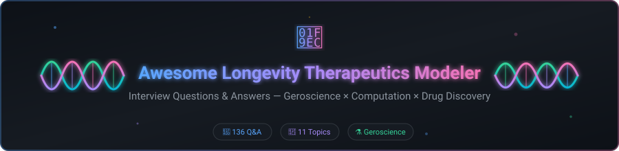

<!-- Awesome Longevity Therapeutics Modeler Interview Questions — 136 curated Q&A covering geroscience, aging biology, biomarkers, aging clocks, geroprotective drug discovery, computational aging models, multi-omics, longevity clinical trial design, and machine learning for aging research. -->

  

  
  
  
  
  
  

---

# 🧬 Longevity Therapeutics Modeler — Interview Questions

> 🌟 A curated collection of interview questions (with answers) for **Longevity Therapeutics Modeler** roles — computational and quantitative scientists working at longevity biotech companies, academic geroscience labs, and pharma longevity programs, who build and apply models (from molecular/systems biology models through aging clocks to clinical trial designs) to support the discovery and development of therapeutics intended to slow, halt, or reverse aspects of biological aging.

🔬 This is a real and rapidly growing field — geroscience (the study of aging as a modifiable biological process, rather than an inevitable, unmodifiable backdrop to individual diseases) has moved from a niche academic pursuit to a well-funded area of biotech investment over the past decade, and roles combining computational/quantitative modeling skill with aging biology domain knowledge are genuinely being hired for at longevity-focused companies, academic aging research centers, and pharma programs increasingly interested in "aging as a drug target." The specific title "Longevity Therapeutics Modeler" is less standardized than more established titles like "Computational Biologist" or "Biostatistician," but the underlying job — building quantitative models spanning molecular aging biology, aging biomarkers/clocks, and the clinical trial designs needed to actually test whether a geroprotective intervention works — is a genuine, current hiring need in this space.

> [!WARNING]
> **⚠️ Disclaimer:** This is a community knowledge base, not a certification or official curriculum. Answers aim to be technically sound and interview-appropriate — concise, structured, demonstrating reasoning — not exhaustive textbook chapters. Geroscience is a genuinely young field with a lot of active scientific debate and rapidly evolving evidence; always verify current literature, and be appropriately skeptical of any claim (including some claims embedded in this repo, if they've since been superseded) that outruns what's actually been rigorously established. This field has a well-documented history of hype outpacing evidence, and this repo tries to model appropriate caution throughout rather than adding to that pattern.

---

## 📚 Contents

| # | Category | File | Questions |
|:-:|----------|------|:---------:|
| 1 | 🧪 Biology of Aging & Hallmarks Fundamentals | [`questions/01-biology-of-aging-hallmarks-fundamentals.md`](questions/01-biology-of-aging-hallmarks-fundamentals.md) | 20 |
| 2 | ⏳ Biomarkers & Clocks of Aging | [`questions/02-biomarkers-clocks-of-aging.md`](questions/02-biomarkers-clocks-of-aging.md) | 16 |
| 3 | 🖥️ Computational & Systems Modeling of Aging | [`questions/03-computational-systems-modeling-aging.md`](questions/03-computational-systems-modeling-aging.md) | 14 |
| 4 | 🧩 Multi-Omics & Data Integration | [`questions/04-multi-omics-data-integration.md`](questions/04-multi-omics-data-integration.md) | 12 |
| 5 | 🐁 Model Organisms & Translational Validity | [`questions/05-model-organisms-translational-validity.md`](questions/05-model-organisms-translational-validity.md) | 12 |
| 6 | 💊 Geroprotective Target & Drug Discovery | [`questions/06-geroprotective-target-drug-discovery.md`](questions/06-geroprotective-target-drug-discovery.md) | 12 |
| 7 | 📊 Biostatistics & Longevity Trial Design | [`questions/07-biostatistics-longevity-trial-design.md`](questions/07-biostatistics-longevity-trial-design.md) | 12 |
| 8 | 🤖 Machine Learning for Aging & Drug Discovery | [`questions/08-machine-learning-aging-drug-discovery.md`](questions/08-machine-learning-aging-drug-discovery.md) | 10 |
| 9 | ⚖️ Regulatory, Ethics & Evidence Evaluation | [`questions/09-regulatory-ethics-evidence-evaluation.md`](questions/09-regulatory-ethics-evidence-evaluation.md) | 10 |
| 10 | 🏗️ System Design / Case Studies | [`questions/10-system-design-case-studies.md`](questions/10-system-design-case-studies.md) | 4 |
| 11 | 🤝 Behavioral & Cross-Functional | [`questions/11-behavioral-cross-functional.md`](questions/11-behavioral-cross-functional.md) | 14 |

> **🎯 Total: 136 questions with detailed answers.**

---

## 🧭 How to Use This Repo

- 🎓 **Candidates:** Work through categories in order — the hallmarks-of-aging fundamentals (1) and aging biomarkers (2) underpin everything else, and category 9 (evidence evaluation) matters at every level of seniority given how prone this specific field is to overstated claims, not just for senior roles.
- 🧑‍💼 **Interviewers:** Pick 1–2 questions per category rather than exhausting every category in one loop. This field particularly rewards candidates who can distinguish "biologically plausible and mechanistically interesting" from "rigorously demonstrated to extend healthy lifespan in a way that will translate to humans" — several questions throughout this repo are specifically designed to surface whether a candidate makes that distinction reflexively or needs to be prompted toward it.
- 💡 **Everyone:** Answers are written to show *reasoning* — why a given aging biomarker's validation status matters, why a mouse lifespan extension result doesn't automatically imply human relevance — not just to state facts.

---

## 🗂️ Difficulty Tags

| Tag | Level | Description |
|:---:|-------|-------------|
| 🟢 | **Foundational** | Expected of any candidate |
| 🟡 | **Intermediate** | Mid-level, role-specific depth |
| 🔴 | **Advanced** | Senior/staff-level, open-ended, or research-adjacent |

---

## 🤝 Contributing

✨ Contributions welcome, especially from people with real backgrounds in aging biology, computational/systems biology, biostatistics, or longevity drug discovery. See [`CONTRIBUTING.md`](CONTRIBUTING.md).

---

## 📄 License

📜 [CC BY-SA 4.0](LICENSE) — free to use and adapt, with attribution, sharing improvements back under the same license.

---

## 🔑 Keywords

`longevity therapeutics` · `geroscience interview questions` · `aging biology` · `hallmarks of aging` · `epigenetic clocks` · `biological age` · `geroprotective drugs` · `rapamycin` · `senolytics` · `computational aging models` · `systems biology of aging` · `multi-omics aging` · `longevity clinical trials` · `TAME trial` · `machine learning drug discovery` · `aging biomarkers` · `GrimAge` · `DunedinPACE` · `model organisms aging` · `biostatistics longevity`

---

## 🔗 Related Resources

- 🧬 [Awesome Aging Research](https://github.com/topics/aging) — GitHub topic for aging-related repositories
- 📖 [Hallmarks of Aging (López-Otín et al.)](https://doi.org/10.1016/j.cell.2013.05.039) — Foundational review paper
- 🏥 [TAME Trial (Targeting Aging with Metformin)](https://www.afar.org/tame-trial) — Landmark geroscience clinical trial
- 🤖 [Awesome Drug Discovery with ML](https://github.com/ishandutta2007/Awesome-Awesome-Awesome) — Curated awesome lists

---

  Made with ❤️ for the geroscience & longevity therapeutics community
   
  ⭐ Star this repo if you find it useful!

